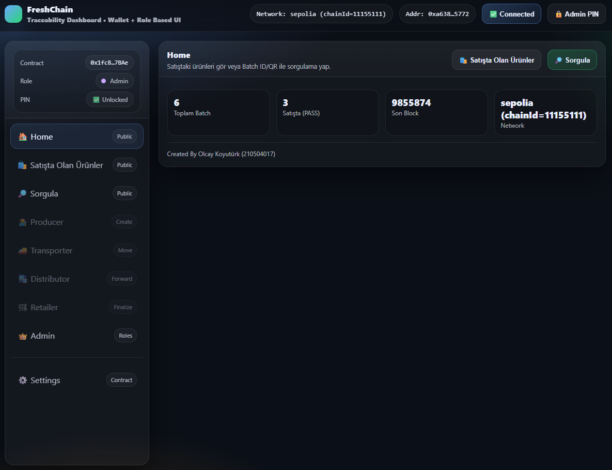
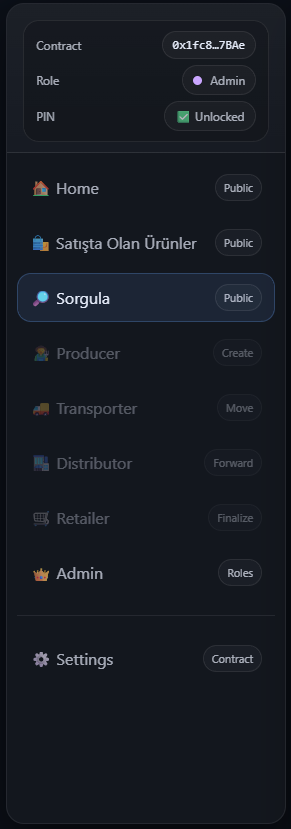
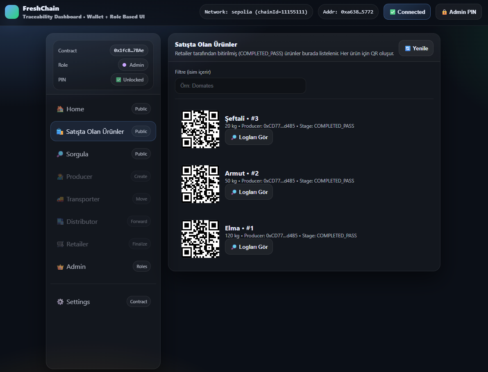
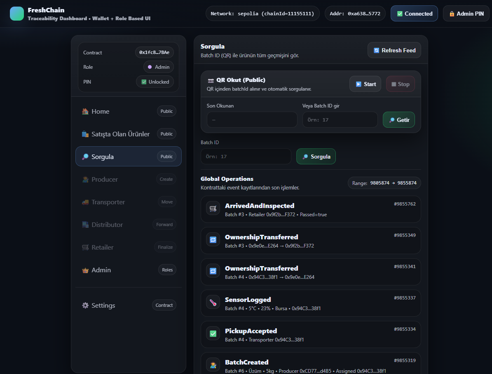
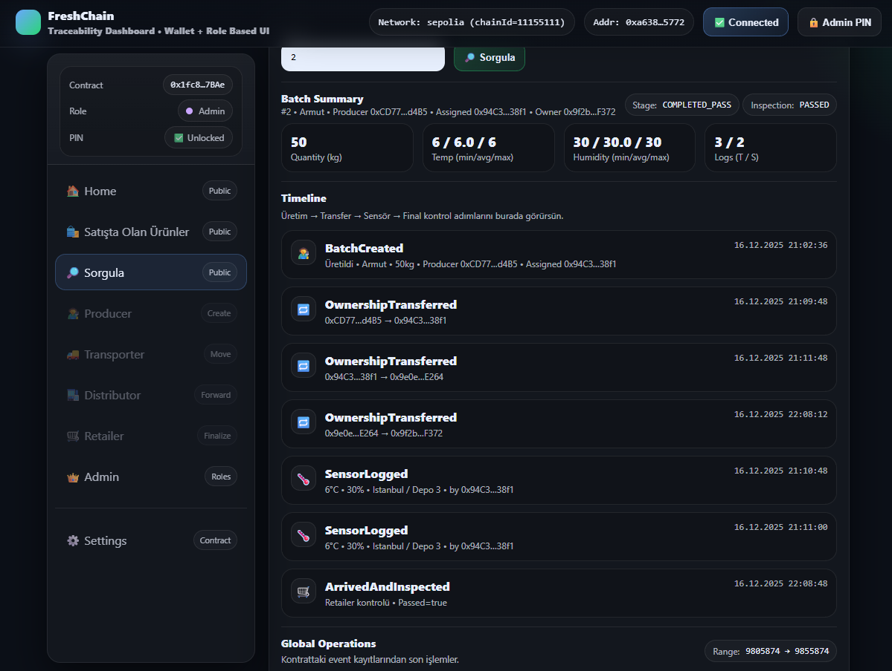

# FreshChain  
### Blockchain-Based Supply Chain Traceability Platform

FreshChain is a web-based traceability system that enables transparent and immutable tracking of products throughout the supply chain using blockchain technology. The platform supports both **public users** and **authorized supply-chain roles**, providing secure access to product lifecycle data.

---

## Overview

FreshChain allows a product to be tracked from **producer to retailer**, ensuring trust, transparency, and data integrity.  
Public users can verify products via **QR codes**, while authorized roles interact with the system according to their permissions.

---

## Key Features

### Blockchain Traceability
- Product batches are recorded on-chain
- All records are immutable and transparent
- Full lifecycle visibility: production, transport, distribution, retail

### Public QR Code Query
- Camera-based QR scanning via web browser
- Designed for real-world usage (printed QR codes on products or paper)
- Automatically extracts `Batch ID` from QR content
- Displays complete product history in **read-only mode**
- No wallet or blockchain transaction required for public users

### Role-Based Access Control
- Supported roles:
  - Producer
  - Transporter
  - Distributor
  - Retailer
  - Admin
- Each role can only perform authorized actions
- Unauthorized operations are blocked at both UI and smart contract level

### Modular Frontend Architecture
The frontend has been refactored from a single large file into a clean modular structure:

- `index.html` – Application structure
- `styles.css` – UI styling and layout
- `app.js` – Application logic and blockchain interactions

This refactor preserves all functionality while improving readability, maintainability, and scalability.

---

## Application Screenshots

FreshChain provides a role-based traceability dashboard where supply chain actors manage product batches on-chain, while public users can transparently query products using QR codes or Batch IDs.

---

### Home Dashboard

The Home screen presents a high-level overview of the system, including total batch count, products currently on sale, latest blockchain block number, and the active network.  
It also serves as the main entry point for navigating public queries and market-listed products.

---

### Role-Based Navigation Menu

  

The sidebar menu dynamically adapts to the connected wallet’s role.  
Authorized roles (Producer, Transporter, Distributor, Retailer, Admin) can only access actions permitted by the smart contract, while public users are limited to read-only views.

---

### Products on Sale (QR Market)

This screen lists products that have successfully completed the supply chain process (`COMPLETED_PASS`).  
Each product is automatically assigned a QR code, enabling consumers to verify product authenticity and history using camera-based scanning.

---

### Public Query & QR Scanning

The Query page allows users to retrieve a product’s full lifecycle either by entering a Batch ID manually or by scanning a QR code via the device camera.  
All retrieved data is read directly from immutable blockchain event logs.

---

### Batch Summary & Timeline

The Batch Summary view displays detailed analytics such as quantity, temperature and humidity ranges, inspection results, and ownership transfers.  
A chronological timeline visualizes every on-chain event from batch creation to final inspection.

## Technology Stack

- **Smart Contracts:** Solidity (EVM compatible)
- **Frontend:** HTML, CSS, JavaScript
- **Blockchain Integration:** Ethers.js
- **QR Scanning:** html5-qrcode
- **Wallet Integration:** MetaMask
- **Development Tools:** Remix IDE

---

## Use Cases

FreshChain is suitable for:
- Academic blockchain projects
- Supply chain transparency demonstrations
- QR-based product verification systems
- Public traceability dashboards

---

## License

This project is developed for educational and demonstration purposes.
